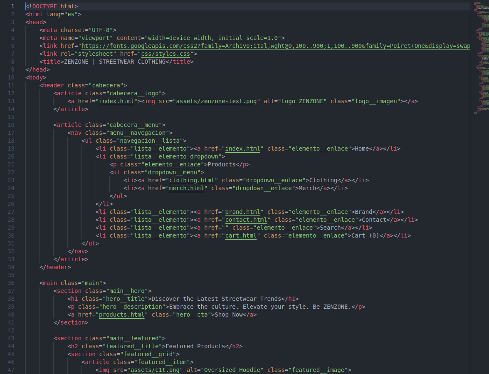
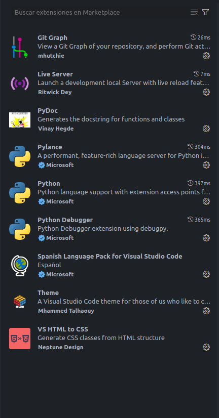
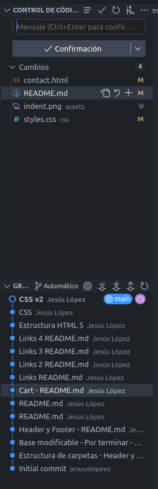
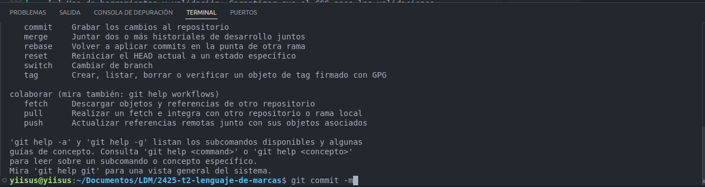
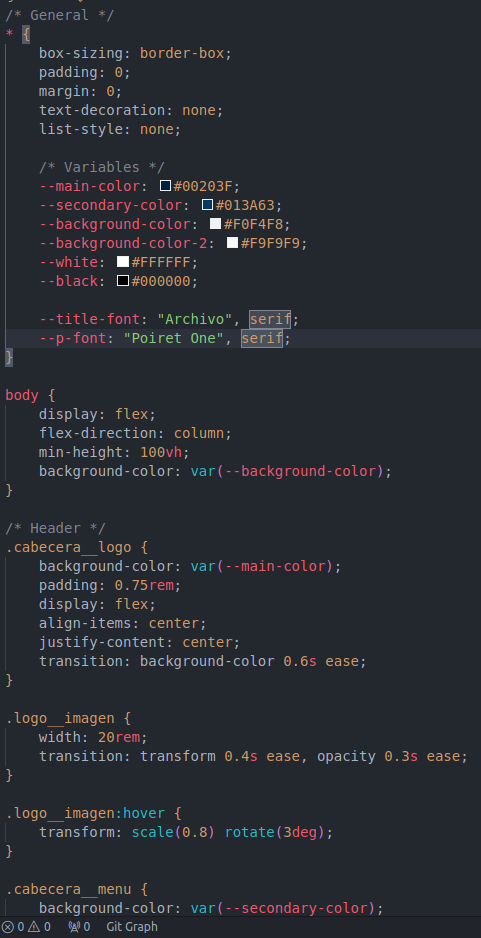
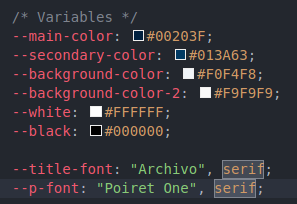

# **Proyecto 2: “Desarrollo con Estándares Web”**
## Contexto del proyecto
  

Este proyecto trata sobre una marca de ropa llamada "ZENZONE", he realizado una web de ella, que tiene como propósito dar a conocer la marca junto a la posibilidad de comprar sus productos de manera online. La página se forma de varios apartados como la tienda online, los formularios de contacto o la página de la marca, que va orientada a informar al cliente.

Para hacer esta página hemos utilizado HTML y CSS, aunque en el futuro se le integrarán nuevas funciones con JavaScript (JS), intentando seguir unas buenas prácticas indicadas por el profesor y validando el código con páginas como [W3CValidator](https://validator.w3.org/).

## Requisitos
### 1. Estructura HTML 5
#### Crear un documento con las secciones principales.  
***Header:***
https://github.com/jesuuslopeez/2425-t2-lenguaje-de-marcas/blob/67b8944399cbc4e95c862d6ead152d5d6071db75/index.html#L11-L34

***Footer:*** 
https://github.com/jesuuslopeez/2425-t2-lenguaje-de-marcas/blob/67b8944399cbc4e95c862d6ead152d5d6071db75/index.html#L79-L131

#### Usar etiquetas semánticas para organizar el contenido de cada página.
- `<html>`: Etiqueta principal de la página, que construye la estructura HTML.  https://github.com/jesuuslopeez/2425-t2-lenguaje-de-marcas/blob/fa5c0748d62e0916b1941ff29b3286e7fe50c93f/index.html#L2-L134
- `<head>`: Etiqueta de la cabeza de página, que recoge los metadatos, los enlaces a APIs y páginas, título de la pestaña, favicon y muchas más cosas.  https://github.com/jesuuslopeez/2425-t2-lenguaje-de-marcas/blob/fa5c0748d62e0916b1941ff29b3286e7fe50c93f/index.html#L3-L9
- `<link>`: Etiqueta que enlaza otras páginas o APIs para complementar la página.  https://github.com/jesuuslopeez/2425-t2-lenguaje-de-marcas/blob/fa5c0748d62e0916b1941ff29b3286e7fe50c93f/index.html#L6-L7
- `<title>`: Etiqueta que le da el título a la pestaña de la página en el navegador. https://github.com/jesuuslopeez/2425-t2-lenguaje-de-marcas/blob/8c65bfd6bc946e194d6b1c5fd0d549d03a35bfd1/contact.html#L8
- `<body>`:  Etiqueta principal del cuerpo de la página que recoge las partes de la misma, como son la cabecera, el cuerpo y el pie de página.  https://github.com/jesuuslopeez/2425-t2-lenguaje-de-marcas/blob/fa5c0748d62e0916b1941ff29b3286e7fe50c93f/index.html#L10-L133
- `<header>`: Etiqueta de la cabecera de una página.  https://github.com/jesuuslopeez/2425-t2-lenguaje-de-marcas/blob/fa5c0748d62e0916b1941ff29b3286e7fe50c93f/index.html#L11-L34
- `<article>`: Etiqueta que forma un bloque en la página para dividirlo de otras partes.  https://github.com/jesuuslopeez/2425-t2-lenguaje-de-marcas/blob/1d856abcee11dda41c129a356ee6f9fb9f778a41/index.html#L12-L14
- `<a>`: Etiqueta utilizada para enlazar páginas entre si.  https://github.com/jesuuslopeez/2425-t2-lenguaje-de-marcas/blob/1d856abcee11dda41c129a356ee6f9fb9f778a41/index.html#L13
- ``: Etiqueta para añadir imágenes a la página web.  https://github.com/jesuuslopeez/2425-t2-lenguaje-de-marcas/blob/1d856abcee11dda41c129a356ee6f9fb9f778a41/index.html#L112
- `<nav>`: Etiqueta para el menú de navegación con otras páginas.  https://github.com/jesuuslopeez/2425-t2-lenguaje-de-marcas/blob/1d856abcee11dda41c129a356ee6f9fb9f778a41/index.html#L17-L32
- `<ul>`: Etiqueta de una lista desordenada.  https://github.com/jesuuslopeez/2425-t2-lenguaje-de-marcas/blob/1d856abcee11dda41c129a356ee6f9fb9f778a41/index.html#L18-L31
- `<li>`: Etiqueta de los elementos de la lista.  https://github.com/jesuuslopeez/2425-t2-lenguaje-de-marcas/blob/1d856abcee11dda41c129a356ee6f9fb9f778a41/index.html#L19
- `
`: Etiqueta para parrafos de texto.  https://github.com/jesuuslopeez/2425-t2-lenguaje-de-marcas/blob/1d856abcee11dda41c129a356ee6f9fb9f778a41/index.html#L21
- `<main>`: Etiqueta del cuerpo principal de la página, donde irá todo lo que no sea la cabecera o el pie de página.  https://github.com/jesuuslopeez/2425-t2-lenguaje-de-marcas/blob/1d856abcee11dda41c129a356ee6f9fb9f778a41/index.html#L36-L77
- `<section>`: Etiqueta para dividir por secciones las partes de la página.  https://github.com/jesuuslopeez/2425-t2-lenguaje-de-marcas/blob/1d856abcee11dda41c129a356ee6f9fb9f778a41/index.html#L37-L41
- `<h1>`: Etiqueta para poner un título a la página, también se pueden utilizar `h2`, `h3`, `h4`, `h5`, `h6`.  https://github.com/jesuuslopeez/2425-t2-lenguaje-de-marcas/blob/1d856abcee11dda41c129a356ee6f9fb9f778a41/index.html#L38
- `<footer>`: Etiqueta para el pie de página.  https://github.com/jesuuslopeez/2425-t2-lenguaje-de-marcas/blob/1d856abcee11dda41c129a356ee6f9fb9f778a41/index.html#L79-L131
- `<button>`: Etiqueta para crear un botón al que añadirle funciones. https://github.com/jesuuslopeez/2425-t2-lenguaje-de-marcas/blob/1d856abcee11dda41c129a356ee6f9fb9f778a41/contact.html#L69
- `<form>`: Etiqueta base para crear un formulario. https://github.com/jesuuslopeez/2425-t2-lenguaje-de-marcas/blob/1d856abcee11dda41c129a356ee6f9fb9f778a41/contact.html#L39-L70
- `<fieldset>`: Etiqueta para agrupar varios elementos de un formulario.  https://github.com/jesuuslopeez/2425-t2-lenguaje-de-marcas/blob/1d856abcee11dda41c129a356ee6f9fb9f778a41/contact.html#L40-L63
- `<legend>`: Etiqueta utilizada para describir los campos a rellenar.  https://github.com/jesuuslopeez/2425-t2-lenguaje-de-marcas/blob/1d856abcee11dda41c129a356ee6f9fb9f778a41/contact.html#L41
- `<label>`: Etiqueta que le da nombre al campo.  https://github.com/jesuuslopeez/2425-t2-lenguaje-de-marcas/blob/1d856abcee11dda41c129a356ee6f9fb9f778a41/contact.html#L43
- `<input>`: Etiqueta en la que el usuario introduce o marca algo.  https://github.com/jesuuslopeez/2425-t2-lenguaje-de-marcas/blob/1d856abcee11dda41c129a356ee6f9fb9f778a41/contact.html#L44  

#### Implementar un formulario funcional con al menos seis campos diferentes, asegurando la validación de campos requeridos y tipos de datos adecuados.
- Formulario estilo Newsletter  
https://github.com/jesuuslopeez/2425-t2-lenguaje-de-marcas/blob/8f70a2d601659a2f4abd0a769ac2897647350c0e/brand.html#L63-L92  
  

- Formulario de contacto  
https://github.com/jesuuslopeez/2425-t2-lenguaje-de-marcas/blob/8f70a2d601659a2f4abd0a769ac2897647350c0e/contact.html#L37-L71  
  

#### Las cuatro páginas deben tener estructuras distintas, no solamente elementos seguidos en columna.
- Página 1:  
https://github.com/jesuuslopeez/2425-t2-lenguaje-de-marcas/blob/8f70a2d601659a2f4abd0a769ac2897647350c0e/index.html#L1-L134

- Página 2:  
https://github.com/jesuuslopeez/2425-t2-lenguaje-de-marcas/blob/8f70a2d601659a2f4abd0a769ac2897647350c0e/clothing.html#L1-L155

- Página 3:  
https://github.com/jesuuslopeez/2425-t2-lenguaje-de-marcas/blob/8f70a2d601659a2f4abd0a769ac2897647350c0e/brand.html#L1-L152

- Página 4:  
https://github.com/jesuuslopeez/2425-t2-lenguaje-de-marcas/blob/8f70a2d601659a2f4abd0a769ac2897647350c0e/contact.html#L1-L169

- Página 5: 
https://github.com/jesuuslopeez/2425-t2-lenguaje-de-marcas/blob/8f70a2d601659a2f4abd0a769ac2897647350c0e/cart.html#L1-L153

- Página 6:  
https://github.com/jesuuslopeez/2425-t2-lenguaje-de-marcas/blob/8f70a2d601659a2f4abd0a769ac2897647350c0e/brand.html#L1-L152

### 2. Estilos CSS 3
#### Usar una única hoja de estilos para toda la web, organizada mediante la metodología BEM para mantener consistencia y claridad.
- Único archivo CSS ->   [`styles.css`](css/styles.css)
- Metodología BEM:  
https://github.com/jesuuslopeez/2425-t2-lenguaje-de-marcas/blob/6367847bee1e7244020fa18837e7303c6623682b/css/styles.css#L29-L105

#### Usar variables CSS para definir colores y tipografías, permitiendo fácil actualización del diseño.
- Variables:  
https://github.com/jesuuslopeez/2425-t2-lenguaje-de-marcas/blob/5e1129c0a05c5182414168478a24967bee692fea/css/styles.css#L9-L19

#### Implementar un diseño responsive mediante media queries.

#### Incluir un diseño básico con soporte para Dark Mode.
- Variables:  
https://github.com/jesuuslopeez/2425-t2-lenguaje-de-marcas/blob/5e1129c0a05c5182414168478a24967bee692fea/css/styles.css#L9-L19

- Uso de variables:  
https://github.com/jesuuslopeez/2425-t2-lenguaje-de-marcas/blob/5e1129c0a05c5182414168478a24967bee692fea/css/styles.css#L67-L73

#### Crear transiciones y animaciones que mejoren la experiencia del usuario, aplicándolas a elementos clave como botones, menús o imágenes.
- Ejemplos:  

https://github.com/jesuuslopeez/2425-t2-lenguaje-de-marcas/blob/5e1129c0a05c5182414168478a24967bee692fea/css/styles.css#L43-L45  

https://github.com/jesuuslopeez/2425-t2-lenguaje-de-marcas/blob/5e1129c0a05c5182414168478a24967bee692fea/css/styles.css#L75-L77  

https://github.com/jesuuslopeez/2425-t2-lenguaje-de-marcas/blob/5e1129c0a05c5182414168478a24967bee692fea/css/styles.css#L99-L101

### 3. Contenido esencial
#### Crear un menú de navegación funcional que enlace correctamente las páginas.
https://github.com/jesuuslopeez/2425-t2-lenguaje-de-marcas/blob/e9461807284aa5865e7e531be9937d768752d6ae/index.html#L17-L32

#### Incorporar una página con datos relevantes del cliente.
https://github.com/jesuuslopeez/2425-t2-lenguaje-de-marcas/blob/e9461807284aa5865e7e531be9937d768752d6ae/contact.html#L1-L169

#### Añadir elementos multimedia que enriquezca la parte visual.
- Estos elementos multimedia se encuentran almacenados en la carpeta [`Assets`](/assets/).

#### La jerarquía de la información debe estar clara.

### 4. Páginas requeridas
- [Página principal](index.html): Breve introducción y resumen del sitio.
- Página de servicios o [productos](clothing.html): Descripción detallada del catálogo o servicios del cliente.
- [Página de contacto](contact.html): Formulario funcional y enlaces a redes sociales.
- [Página adicional](cart.html): De libre elección según el contexto (blog, testimonios, galería, etc.).

### 5. Validación
#### HTML:
***Index:***  
  
***Clothing:***  
  
***Merch:***  
  
***Brand:***  
  
***Contact:***  
  
***Cart:***  
  

#### CSS:
  
### 6. Entregable
 - [x] Archivos HTML
 - [x] Carpeta [`/css`](/css) con archivo [`styles.css`](/css/styles.css)
 - [x] Carpeta [`/js`](/js/)
 - [x] Carpeta [`/assets`](/assets/) con imágenes y vídeos correspondientes
 - [x] Archivo [`README.md`](/README.md) explicativo  
 
  

## Evaluación
### b) Se ha analizado la estructura de un documento HTML e identificado las secciones que lo componen.
- [x] Indentación y legibilidad: Código correctamente indentado para facilitar la lectura.
    - 
- [x] Uso de etiquetas semánticas: Uso adecuado de etiquetas como header, main, footer, section, article, entre otras.
    - `Header`:  
     https://github.com/jesuuslopeez/2425-t2-lenguaje-de-marcas/blob/67b8944399cbc4e95c862d6ead152d5d6071db75/index.html#L11-L34
    - `Main`:  
    https://github.com/jesuuslopeez/2425-t2-lenguaje-de-marcas/blob/67b8944399cbc4e95c862d6ead152d5d6071db75/index.html#L36-L77
    - `Footer`:  
    https://github.com/jesuuslopeez/2425-t2-lenguaje-de-marcas/blob/67b8944399cbc4e95c862d6ead152d5d6071db75/index.html#L79-L131
    - `Section`:  
    https://github.com/jesuuslopeez/2425-t2-lenguaje-de-marcas/blob/67b8944399cbc4e95c862d6ead152d5d6071db75/index.html#L37-L41
    - `Article`:  
    https://github.com/jesuuslopeez/2425-t2-lenguaje-de-marcas/blob/67b8944399cbc4e95c862d6ead152d5d6071db75/index.html#L12-L14
- [x] Comentarios: Uso de comentarios útiles para explicar la estructura del documento.
- [x] Organización lógica: Estructura jerárquica y lógica que refleje la intención del contenido del documento.
    - Organización del `index.html`:  
    https://github.com/jesuuslopeez/2425-t2-lenguaje-de-marcas/blob/67b8944399cbc4e95c862d6ead152d5d6071db75/index.html#L1-L134
- [x] Validación: Código que pase las validaciones del W3C sin errores.
    -   
    -   
    -   
    -   
    -   
    -   

### c) Se ha reconocido y aplicado de forma práctica la funcionalidad de las principales etiquetas y los atributos del lenguaje HTML.
- [x] Uso adecuado de etiquetas clave: Correcta implementación de etiquetas como img, a, form, y otras relevantes.
    - `Img`:  
    https://github.com/jesuuslopeez/2425-t2-lenguaje-de-marcas/blob/67b8944399cbc4e95c862d6ead152d5d6071db75/index.html#L74
    - `A`:  
    https://github.com/jesuuslopeez/2425-t2-lenguaje-de-marcas/blob/67b8944399cbc4e95c862d6ead152d5d6071db75/index.html#L71
    - `Form`:  
    https://github.com/jesuuslopeez/2425-t2-lenguaje-de-marcas/blob/67b8944399cbc4e95c862d6ead152d5d6071db75/brand.html#L68-L91
- [x] Semántica: Uso de etiquetas semánticas como header, section, footer en lugar de div genéricos.
    - `Header`:  
         https://github.com/jesuuslopeez/2425-t2-lenguaje-de-marcas/blob/67b8944399cbc4e95c862d6ead152d5d6071db75/index.html#L11-L34
    - `Footer`:  
        https://github.com/jesuuslopeez/2425-t2-lenguaje-de-marcas/blob/67b8944399cbc4e95c862d6ead152d5d6071db75/index.html#L79-L131
    - `Section`:  
        https://github.com/jesuuslopeez/2425-t2-lenguaje-de-marcas/blob/67b8944399cbc4e95c862d6ead152d5d6071db75/index.html#L37-L41
- [x] Atributos globales: Aplicación de atributos globales como id, class, title, o style en los contextos adecuados.
    - Atributos globales en `index.html`:  
    https://github.com/jesuuslopeez/2425-t2-lenguaje-de-marcas/blob/67b8944399cbc4e95c862d6ead152d5d6071db75/index.html#L1-L134
- [x] Validación: Garantizar que el código HTML pase las validaciones del W3C.
    -   
    -   
    -   
    -   
    -   
    -   
- [x] Comentarios y legibilidad: Añadir comentarios útiles y mantener una estructura clara y organizada del código.

### e) Se han utilizado herramientas en la creación de documentos web.
- [x] Optimización del editor: Uso de extensiones, temas, y configuraciones específicas para mejorar la productividad (por ejemplo, Prettier, linters o Emmet).
    - Extensiones de Visual Studio Code instaladas:  
      
- [x] Control de versiones: Aplicación de Git para gestionar versiones del proyecto y uso adecuado de GitHub para compartir el trabajo.
    - Control de versiones desde Visual Studio Code:  
      
- [x] Validación: Uso de validadores como el W3C Validator para HTML y CSS.
    -   
    -   
    -   
    -   
    -   
    -  
    -   
- [x] Organización de archivos: Mantener una estructura clara de carpetas y archivos dentro del proyecto.
    - Estructura del proyecto:  
      
- [x] Eficiencia en el flujo de trabajo: Uso de atajos de teclado, terminal integrada, y otros recursos para optimizar la creación de documentos web.
    - Uso de terminal para control de versiones:
        

### f) Se han identificado y demostrado de forma práctica las ventajas que aporta la utilización de hojas de estilo.
- [x] Organización del código: Separación clara entre secciones del CSS y comentarios explicativos cuando sea necesario.
    - Separación del CSS por comentarios de texto.
    
- [x] Uso de herramientas y validación: Garantizar que el CSS pase las validaciones del W3C y utilizar editores que faciliten el seguimiento de las normas.
    -   
- [x] Evitar repeticiones: Aplicación de principios DRY (Don't Repeat Yourself) en la hoja de estilos.
- [x] Claridad y mantenimiento: Uso de variables CSS y estructuras que permitan cambios fáciles y rápidos en el diseño.
    - Uso de variables:
    

### g) Se han aplicado hojas de estilo.
- [x] Metodología BEM: Organización del CSS utilizando la metodología BEM para facilitar la claridad y la reutilización.
    - Utilizada en [styles.css](/css/styles.css)
- [x] Uso de variables: Implementación de variables para definir colores, tipografías y otros aspectos repetitivos del diseño.
    - Uso de variables:
    
- [x] Responsive Design: Uso de media queries para garantizar la adaptabilidad del diseño a diferentes dispositivos.
    - https://github.com/jesuuslopeez/2425-t2-lenguaje-de-marcas/blob/06a6fca1aa1496ca11305c4398cc3b51cb603c87/css/styles.css#L1108-L1193
- [x] Dark Mode: Implementación básica de un tema oscuro utilizando CSS variables o clases específicas.
    - Preparado a través de variables para un cambio futuro con JS.
    
- [x] Transiciones y animaciones: Uso de propiedades como transition y @keyframes para mejorar la experiencia del usuario.
    - https://github.com/jesuuslopeez/2425-t2-lenguaje-de-marcas/blob/5e1129c0a05c5182414168478a24967bee692fea/css/styles.css#L43-L45  

    - https://github.com/jesuuslopeez/2425-t2-lenguaje-de-marcas/blob/5e1129c0a05c5182414168478a24967bee692fea/css/styles.css#L75-L77  

    - https://github.com/jesuuslopeez/2425-t2-lenguaje-de-marcas/blob/5e1129c0a05c5182414168478a24967bee692fea/css/styles.css#L99-L101
- [x] Organización del archivo CSS: Estructuración del código en secciones claras y comentadas.
    - Separación del CSS por comentarios de texto
    
- [x] Validación: Código CSS que pase las validaciones del W3C sin errores.
    -   

### h) Se han validado documentos HTML y CSS.
- [x] Uso de W3C Validator: Validación de los documentos HTML y CSS utilizando las herramientas adecuadas del W3C Validator, sin errores.
    -   
    -   
    -   
    -   
    -   
    -  
    -   
- [x] Estructura semántica: Validación de la estructura semántica de las páginas HTML y corrección de errores relacionados con el uso de etiquetas.
- [x] Optimización del código: Validación para asegurarse de que el código CSS esté libre de errores de sintaxis y que el archivo sea eficiente.
- [x] Documentación: Incluir instrucciones de validación en el archivo README.md y una descripción clara de cómo se validó el proyecto.
    - [Archivo de información README.md](README.md)

## Conclusión
Este es el final de la documentación sobre mi web de ZENZONE, estoy contento con el resultado, aunque todavia es algo muy básico, pero tengo ganas de integrarle JavaScript para darle algo mas de "vidilla" a la página y hacerla mas "profesional".