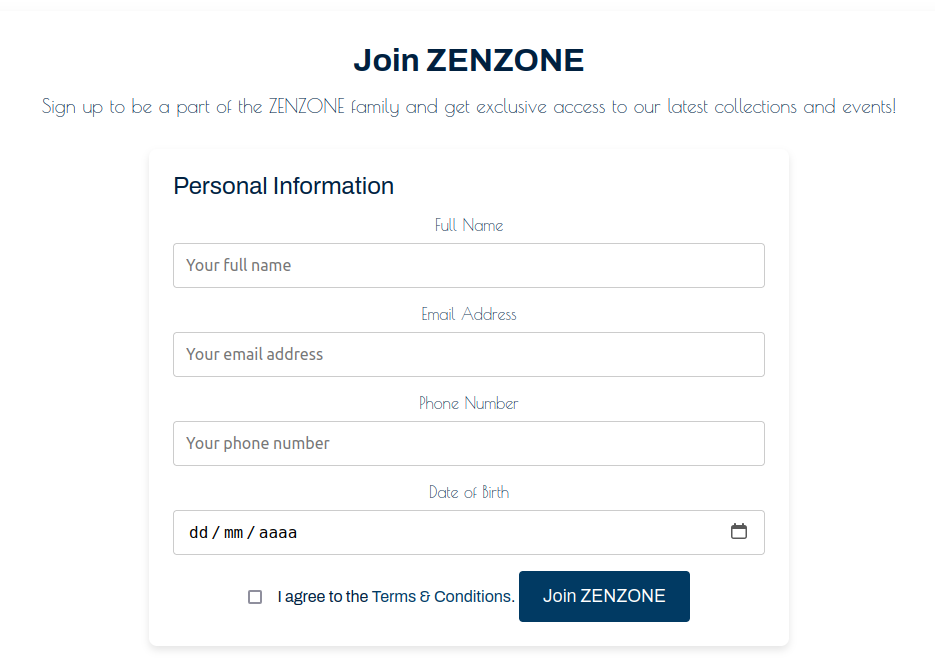
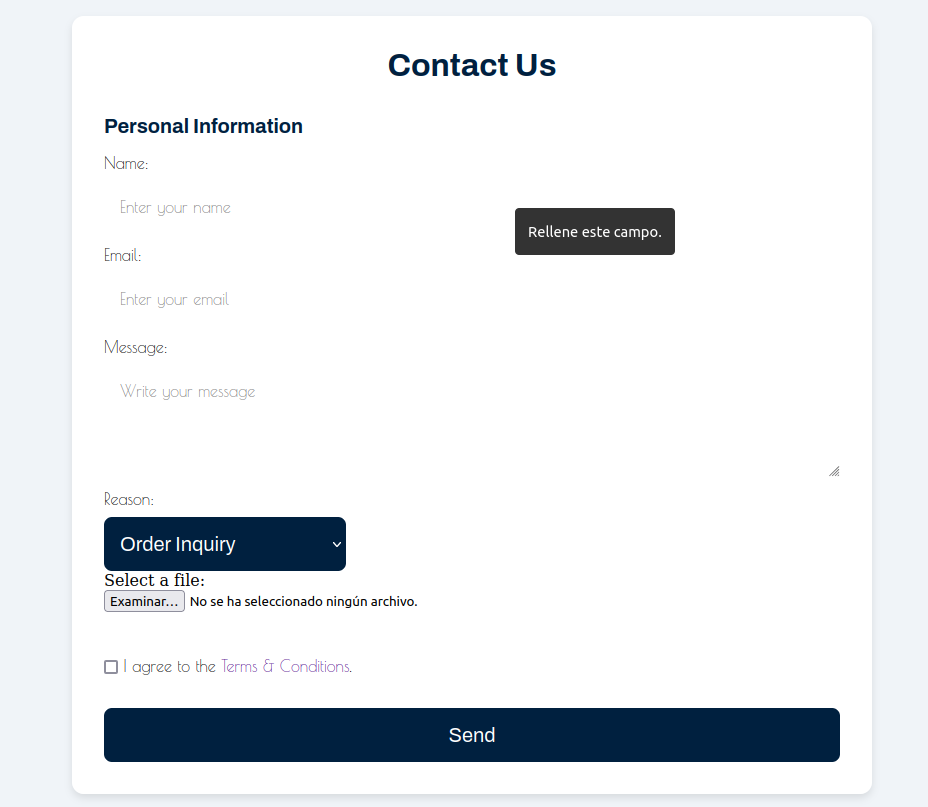
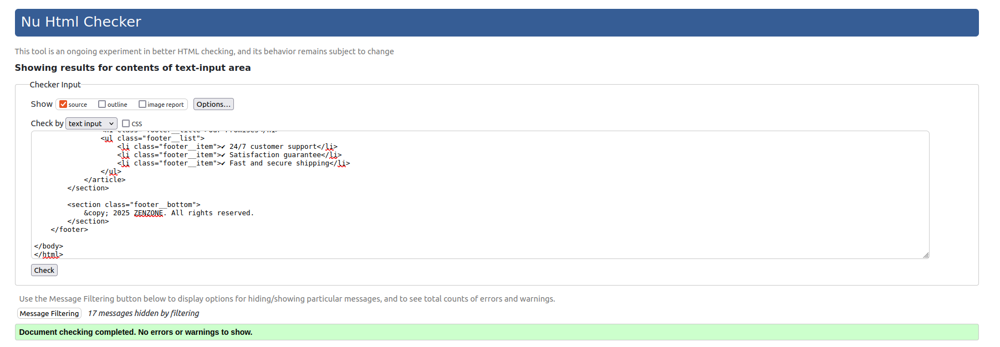
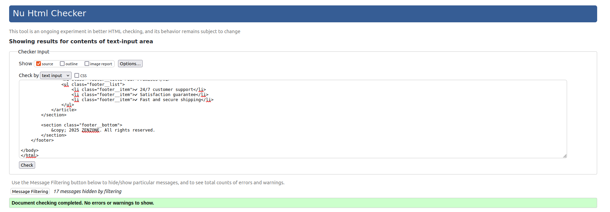
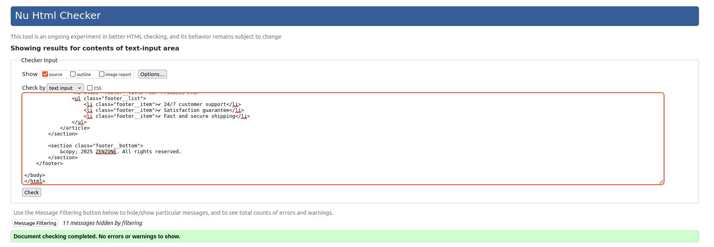
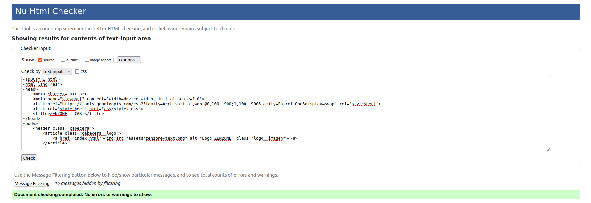
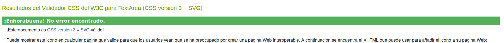
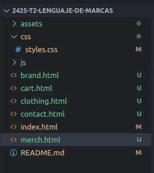

# **Proyecto 2: “Desarrollo con Estándares Web”**
## Contexto del proyecto
  

Este proyecto trata sobre una marca de ropa llamada "ZENZONE", he realizado una web de ella, que tiene como propósito dar a conocer la marca junto a la posibilidad de comprar sus productos de manera online. La página se forma de varios apartados como la tienda online, los formularios de contacto o la página de la marca, que va orientada a informar al cliente.

Para hacer esta página hemos utilizado HTML y CSS, aunque en el futuro se le integrarán nuevas funciones con JavaScript (JS), intentando seguir unas buenas prácticas indicadas por el profesor y validando el código con páginas como [W3CValidator](https://validator.w3.org/).

## Requisitos
### 1. Estructura HTML 5
#### Crear un documento con las secciones principales.  
***Header:***
https://github.com/jesuuslopeez/2425-t2-lenguaje-de-marcas/blob/67b8944399cbc4e95c862d6ead152d5d6071db75/index.html#L11-L34

***Footer:*** 
https://github.com/jesuuslopeez/2425-t2-lenguaje-de-marcas/blob/67b8944399cbc4e95c862d6ead152d5d6071db75/index.html#L79-L131

#### Usar etiquetas semánticas para organizar el contenido de cada página.
- `<html>`: Etiqueta principal de la página, que construye la estructura HTML.  https://github.com/jesuuslopeez/2425-t2-lenguaje-de-marcas/blob/fa5c0748d62e0916b1941ff29b3286e7fe50c93f/index.html#L2-L134
- `<head>`: Etiqueta de la cabeza de página, que recoge los metadatos, los enlaces a APIs y páginas, título de la pestaña, favicon y muchas más cosas.  https://github.com/jesuuslopeez/2425-t2-lenguaje-de-marcas/blob/fa5c0748d62e0916b1941ff29b3286e7fe50c93f/index.html#L3-L9
- `<link>`: Etiqueta que enlaza otras páginas o APIs para complementar la página.  https://github.com/jesuuslopeez/2425-t2-lenguaje-de-marcas/blob/fa5c0748d62e0916b1941ff29b3286e7fe50c93f/index.html#L6-L7
- `<title>`: Etiqueta que le da el título a la pestaña de la página en el navegador. https://github.com/jesuuslopeez/2425-t2-lenguaje-de-marcas/blob/8c65bfd6bc946e194d6b1c5fd0d549d03a35bfd1/contact.html#L8
- `<body>`:  Etiqueta principal del cuerpo de la página que recoge las partes de la misma, como son la cabecera, el cuerpo y el pie de página.  https://github.com/jesuuslopeez/2425-t2-lenguaje-de-marcas/blob/fa5c0748d62e0916b1941ff29b3286e7fe50c93f/index.html#L10-L133
- `<header>`: Etiqueta de la cabecera de una página.  https://github.com/jesuuslopeez/2425-t2-lenguaje-de-marcas/blob/fa5c0748d62e0916b1941ff29b3286e7fe50c93f/index.html#L11-L34
- `<article>`: Etiqueta que forma un bloque en la página para dividirlo de otras partes.  https://github.com/jesuuslopeez/2425-t2-lenguaje-de-marcas/blob/1d856abcee11dda41c129a356ee6f9fb9f778a41/index.html#L12-L14
- `<a>`: Etiqueta utilizada para enlazar páginas entre si.  https://github.com/jesuuslopeez/2425-t2-lenguaje-de-marcas/blob/1d856abcee11dda41c129a356ee6f9fb9f778a41/index.html#L13
- ``: Etiqueta para añadir imágenes a la página web.  https://github.com/jesuuslopeez/2425-t2-lenguaje-de-marcas/blob/1d856abcee11dda41c129a356ee6f9fb9f778a41/index.html#L112
- `<nav>`: Etiqueta para el menú de navegación con otras páginas.  https://github.com/jesuuslopeez/2425-t2-lenguaje-de-marcas/blob/1d856abcee11dda41c129a356ee6f9fb9f778a41/index.html#L17-L32
- `<ul>`: Etiqueta de una lista desordenada.  https://github.com/jesuuslopeez/2425-t2-lenguaje-de-marcas/blob/1d856abcee11dda41c129a356ee6f9fb9f778a41/index.html#L18-L31
- `<li>`: Etiqueta de los elementos de la lista.  https://github.com/jesuuslopeez/2425-t2-lenguaje-de-marcas/blob/1d856abcee11dda41c129a356ee6f9fb9f778a41/index.html#L19
- `
`: Etiqueta para parrafos de texto.  https://github.com/jesuuslopeez/2425-t2-lenguaje-de-marcas/blob/1d856abcee11dda41c129a356ee6f9fb9f778a41/index.html#L21
- `<main>`: Etiqueta del cuerpo principal de la página, donde irá todo lo que no sea la cabecera o el pie de página.  https://github.com/jesuuslopeez/2425-t2-lenguaje-de-marcas/blob/1d856abcee11dda41c129a356ee6f9fb9f778a41/index.html#L36-L77
- `<section>`: Etiqueta para dividir por secciones las partes de la página.  https://github.com/jesuuslopeez/2425-t2-lenguaje-de-marcas/blob/1d856abcee11dda41c129a356ee6f9fb9f778a41/index.html#L37-L41
- `<h1>`: Etiqueta para poner un título a la página, también se pueden utilizar `h2`, `h3`, `h4`, `h5`, `h6`.  https://github.com/jesuuslopeez/2425-t2-lenguaje-de-marcas/blob/1d856abcee11dda41c129a356ee6f9fb9f778a41/index.html#L38
- `<footer>`: Etiqueta para el pie de página.  https://github.com/jesuuslopeez/2425-t2-lenguaje-de-marcas/blob/1d856abcee11dda41c129a356ee6f9fb9f778a41/index.html#L79-L131
- `<button>`: Etiqueta para crear un botón al que añadirle funciones. https://github.com/jesuuslopeez/2425-t2-lenguaje-de-marcas/blob/1d856abcee11dda41c129a356ee6f9fb9f778a41/contact.html#L69
- `<form>`: Etiqueta base para crear un formulario. https://github.com/jesuuslopeez/2425-t2-lenguaje-de-marcas/blob/1d856abcee11dda41c129a356ee6f9fb9f778a41/contact.html#L39-L70
- `<fieldset>`: Etiqueta para agrupar varios elementos de un formulario.  https://github.com/jesuuslopeez/2425-t2-lenguaje-de-marcas/blob/1d856abcee11dda41c129a356ee6f9fb9f778a41/contact.html#L40-L63
- `<legend>`: Etiqueta utilizada para describir los campos a rellenar.  https://github.com/jesuuslopeez/2425-t2-lenguaje-de-marcas/blob/1d856abcee11dda41c129a356ee6f9fb9f778a41/contact.html#L41
- `<label>`: Etiqueta que le da nombre al campo.  https://github.com/jesuuslopeez/2425-t2-lenguaje-de-marcas/blob/1d856abcee11dda41c129a356ee6f9fb9f778a41/contact.html#L43
- `<input>`: Etiqueta en la que el usuario introduce o marca algo.  https://github.com/jesuuslopeez/2425-t2-lenguaje-de-marcas/blob/1d856abcee11dda41c129a356ee6f9fb9f778a41/contact.html#L44  

#### Implementar un formulario funcional con al menos seis campos diferentes, asegurando la validación de campos requeridos y tipos de datos adecuados.
- Formulario estilo Newsletter  
https://github.com/jesuuslopeez/2425-t2-lenguaje-de-marcas/blob/8f70a2d601659a2f4abd0a769ac2897647350c0e/brand.html#L63-L92  
  

- Formulario de contacto  
https://github.com/jesuuslopeez/2425-t2-lenguaje-de-marcas/blob/8f70a2d601659a2f4abd0a769ac2897647350c0e/contact.html#L37-L71  
  

#### Las cuatro páginas deben tener estructuras distintas, no solamente elementos seguidos en columna.
- Página 1:  
https://github.com/jesuuslopeez/2425-t2-lenguaje-de-marcas/blob/8f70a2d601659a2f4abd0a769ac2897647350c0e/index.html#L1-L134

- Página 2:  
https://github.com/jesuuslopeez/2425-t2-lenguaje-de-marcas/blob/8f70a2d601659a2f4abd0a769ac2897647350c0e/clothing.html#L1-L155

- Página 3:  
https://github.com/jesuuslopeez/2425-t2-lenguaje-de-marcas/blob/8f70a2d601659a2f4abd0a769ac2897647350c0e/brand.html#L1-L152

- Página 4:  
https://github.com/jesuuslopeez/2425-t2-lenguaje-de-marcas/blob/8f70a2d601659a2f4abd0a769ac2897647350c0e/contact.html#L1-L169

- Página 5: 
https://github.com/jesuuslopeez/2425-t2-lenguaje-de-marcas/blob/8f70a2d601659a2f4abd0a769ac2897647350c0e/cart.html#L1-L153

- Página 6 (Relleno):  
https://github.com/jesuuslopeez/2425-t2-lenguaje-de-marcas/blob/8f70a2d601659a2f4abd0a769ac2897647350c0e/brand.html#L1-L152

### 2. Estilos CSS 3
#### Usar una única hoja de estilos para toda la web, organizada mediante la metodología BEM para mantener consistencia y claridad.
- Único archivo CSS ->   [`styles.css`](css/styles.css)
- Metodología BEM:  
https://github.com/jesuuslopeez/2425-t2-lenguaje-de-marcas/blob/6367847bee1e7244020fa18837e7303c6623682b/css/styles.css#L29-L105

#### Usar variables CSS para definir colores y tipografías, permitiendo fácil actualización del diseño.
- Variables:  
https://github.com/jesuuslopeez/2425-t2-lenguaje-de-marcas/blob/5e1129c0a05c5182414168478a24967bee692fea/css/styles.css#L9-L19

#### Implementar un diseño responsive mediante media queries.

#### Incluir un diseño básico con soporte para Dark Mode.
- Variables:  
https://github.com/jesuuslopeez/2425-t2-lenguaje-de-marcas/blob/5e1129c0a05c5182414168478a24967bee692fea/css/styles.css#L9-L19

- Uso de variables:  
https://github.com/jesuuslopeez/2425-t2-lenguaje-de-marcas/blob/5e1129c0a05c5182414168478a24967bee692fea/css/styles.css#L67-L73

#### Crear transiciones y animaciones que mejoren la experiencia del usuario, aplicándolas a elementos clave como botones, menús o imágenes.
- Ejemplos:  

https://github.com/jesuuslopeez/2425-t2-lenguaje-de-marcas/blob/5e1129c0a05c5182414168478a24967bee692fea/css/styles.css#L43-L45  

https://github.com/jesuuslopeez/2425-t2-lenguaje-de-marcas/blob/5e1129c0a05c5182414168478a24967bee692fea/css/styles.css#L75-L77  

https://github.com/jesuuslopeez/2425-t2-lenguaje-de-marcas/blob/5e1129c0a05c5182414168478a24967bee692fea/css/styles.css#L99-L101

### 3. Contenido esencial

### 4. Páginas requeridas

### 5. Validación
#### HTML:
***Index:***  
  
***Clothing:***  
  
***Merch:***  
  
***Brand:***  
  
***Contact:***  
  
***Cart:***  
  

#### CSS:
  
### 6. Entregable
 - [x] Archivos HTML
 - [x] Carpeta `/css` con archivo `styles.css`
 - [x] Carpeta `/js`
 - [x] Carpeta `/assets`con imágenes y vídeos correspondientes
 - [x] Archivo `README.md`explicativo  
 
  

## Evaluación
